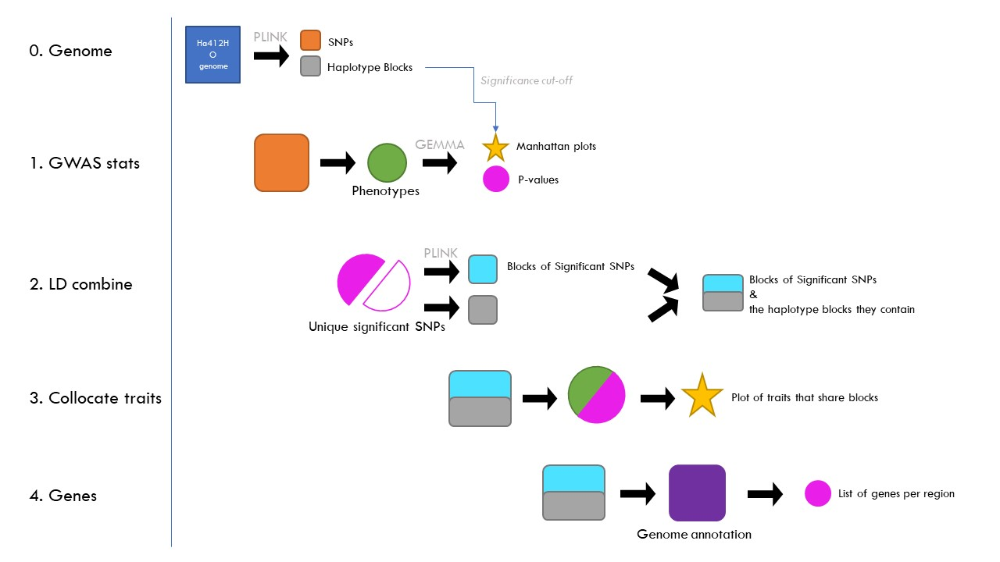

# GWAS_pipeline
## First use (NOTE: requires Linux (Ubuntu) partition on your computer)
### Downloading the pipeline
#### If synching with GitHub (recommended, but requires you know how to use GitHub)
* Clone https://github.com/ericgoolsby/GWAS_pipeline.git from your Desktop GitHub client (or from command line).
#### If just downloading the repository
* Download the zipped repository here (https://github.com/ericgoolsby/GWAS_pipeline/archive/master.zip). 
#### Downloading required software
* Download required software here (https://drive.google.com/open?id=1tQ7ve20fS53lFqpet_-mCxvGBsRZULrt) and unzip it to the Software/ directory. IMPORTANT: MAKE SURE ALL FILES (e.g. XRQv1_412_261_filtered.fam) ARE IN Software/ DIRECTORY (i.e., not in a subfolder).

## Mason/Goolsby Lab modified steps (assuming sunflower GWAS performed in a SINGLE environment)
### Initial data file prep:
1. Put a .csv data file in the data/ directory. The first row should have column names, and each subsequent row corresponds to a SAM line.
2. The first column should have the SAM line number as either integers or in EXACTLY the following format: e.g. SAM002, SAM073, SAM241, etc.
3. Remove all special characters in column (trait) names (but don't worry about underscores -- they will be automatically removed). The first character of a trait name should be a letter, the rest of the trait name should be letters and numbers ONLY.
4. You should leave missing data blank (don't put NA).
5. Make sure your data are numeric (common errors that break the pipeline: a space instead of a blank cell; putting N/A instead of a blank cell; a comma instead of a decimal place, etc).

## Mason/Goolsby Lab modified steps (assuming sunflower GWAS performed in a Multiple environment)
### Initial data file prep:
1. Put a .csv data file in the data/ directory. The first row should have column names, and each subsequent row corresponds to a SAM line.
2. The first column should have the SAM line number as either integers or in EXACTLY the following format: e.g. SAM002, SAM073, SAM241, etc.
3. Remove all special characters in column (trait) names (but don't worry about underscores -- they will be automatically removed). The first character of a trait name should be a letter, the rest of the trait name should be letters and numbers ONLY.
4. You should leave missing data blank (don't put NA).
5. Make sure your data are numeric (common errors that break the pipeline: a space instead of a blank cell; putting N/A instead of a blank cell; a comma instead of a decimal place, etc).
6. Place the second environment file in data/Environment2. Ensure data is formatted the same as above
7. ensure that the first 5 chars of both corresponding files are the same this will aid in matching corresponding data sets 

### Running the pipeline (normal / interactive mode):
1. Open the RStudio project (Sunflower-GWAS-2.0.Rproj) Or, if you are unable to open the .Rproj file (an RStudio project), simply set the working directory to the root (top-level) directory of the pipeline using the setwd command in R.
2. Open the R script "Scripts/0 - running.R".(0a will allow for running on the cluster assuming a single datafile and a single environment,0c will assume multiple data sets and look for matching Environment2 datasets, Oc Requires no editing however it will run every file located in the data folder)
3. Edit the required information in SECTION 1, then run.(Oc requires no editing and works end to end, However it will run all files in the data folder)
4. Run (but do not edit) SECTION 2. Required packages should install and load automatically. However, this process often results in errors and manual troubleshooting. The best troubleshooting is restarting R and trying again. If that doesn't work after 2-3 attempts, Google the error message and associated package name(s).
5. Run the scripts in SECTION 3 one-by-one, checking for warnings and errors along the way. Troubleshoot as needed.
6. Results will be found in Tables/ and Plots/.
7. *_IMPORTANT: The pipeline (incorrectly) "Environment 2" and "logdiff" environments (where logdiff is supposed to be log(Environment 2)-log(Environment1))._ The only valid results are labeled "Environment 1" or "Common". THE RESULTS FOR Environment 2 AND LOGDIFF ARE MEANINGLESS (BASED ON SIMULATED PLACEHOLDER DATA). In the future these will be propoerly incorporated

## CRITICAL: The only valid results are labeled Common or Environment 1. THE RESULTS FOR Environment 1 AND LOGDIFF ARE MEANINGLESS (BASED ON SIMULATED PLACEHOLDER DATA).

### Running the pipeline via batch scripts (coming soon):

## To Do
### Minor
* (FIXED)Fix Script 6 PNG error when running from cluster
* Document brief summary/rationale with inputs and outputs for each Script.
* Document code and any relevant citations for each script.
* Make each script self-contained (so previous scripts don't need to be run in the same session first)
* Better error messages
* Script submission vs interactive mode (with menu and prompts)
* Step-by-step instructions for each interface and operating system.
* GitHub wiki.
* GitHub Projects / taskboard.
### Major
* Explore simulation-based p-value thresholds.
* Power analysis
* Handle variation or multiple replicates within lines
* Missing data
* Function-valued traits
* Multi-locus / epistatic interactions
* Multivariate traits
* Non-normal / nonlinear data

# End Mason/Goolsby Lab Edits; (remainder is Sunflower-GWAS-2.0 content)

# Sunflower-GWAS-2.0

This is a R only rewrite and extention of the sunflower GWAS pipeline initiated by Rishi Masalia. (Masalia et al., Plos 2018)

This Sunflower-GWAS-2.0 pipeline adds:
- Streamlined folder structure of inputs/outputs/code/software
- GWAS calcuation using GEMMA
- Colocalization visualization using haplotype blocks
- Gene list per haplotype block
- Drawing of manhattan plots with haplotype blocks overlay

UPDATE 2019/05/10: Works like a charm. Needs software data from separate location though

Ongoing improvements:

- List R libraries needed
- Make step 0 script that had bits of code to make kinship file, blocks map, etc
- Write guide
- Flag genes that have significant SNPs for traits in gene list output
- PVE per region following Masalia et al 2018
- Heritability per region
- Epistatis graph (R2 between regions on different chromosomes (within cromosomes already captured in LD plot))

Partial guide language
- The blocks are generated from the 1.5 million SNPs using plink. This divides up the genome in chunks that are co-inherited (according to some set thresholds). We now have condensed the genome from 1.5 million independent SNPs to ~20K independent chunks/regions/blocks. Now from the GEMMA output we get a list of SNPs and their p-values. Since not all SNPs are independent (as evidenced from the blocking procedure) the cutoff for significance is based on the 20K independent blocks we have.
- Another place where the block map we've constructed really shines is finding traits that colocate to the same region. If two or more traits have SNPs that lie in the same block we can say they colocate (possibly pleiotropic but most likely close linkage). So in determining if traits have significant SNPs in the same blocks (even if the SNPs are not the same) all we have to do is figure out if they have common blocks.
- A problem with the blocking procedure is that it's sensitive to missplaced SNPs. The algorithm grows a region by walking along the chromosome and stops if a certain fraction of SNPs don't fit the region it is growing (based on D'). What could happen is that two blocks that are adjacent in reality are broken up by a miss placed cluster of SNPs. If there are traits that hit to the first part of the "true" block and traits that hit to the second part of the "true" block we would be wrong in saying these traits are independent.
- To partially protect against this we can look at the SNPs that are significant for a trait at least once, line up those SNPs and re-do the blocking. If the SNPs from two or more blocks now fully go together in a single block we know that the intervening snps could have been missplaced and for the purposes of determining colocalization we should lump the blocks together.
In the triangle plots I'm showing the LD of the SNPs. The blocks the SNPs belong to in the "genome" row, and the new, significant only SNPs, blocks in the "significant" row. 
